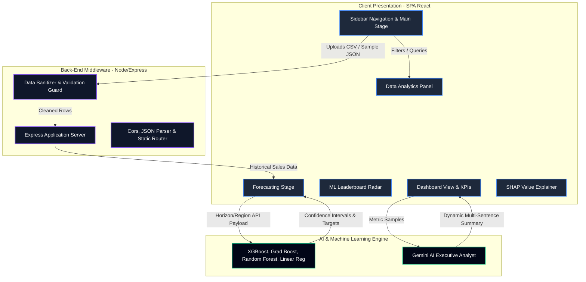
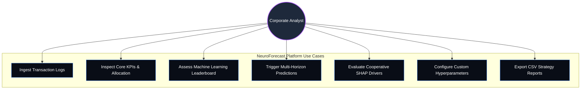

```mermaid
sequenceDiagram
    autonumber
    actor Analyst as Corporate Analyst
    participant UI as React Presentation
    participant Srv as Sanitizer Server
    participant ML as ML Models Engine
    participant AI as Gemini Executive Model

    Analyst->>UI: Uploads CSV / Generates Sample Data
    note over UI: Triggers Row Validation Validation
    UI->>Srv: Delivers validated data payload (JSON arrays)
    
    rect rgb(10, 20, 30)
        note right of Srv: Processing & Feature Imputation
        Srv->>ML: Trains Ensembles (XGBoost vs. Linear)
        ML-->>Srv: Validates metrics (Accuracy, MAE, R², CV Score)
    end
    
    Srv->>UI: Serves model metrics comparison
    UI->>AI: Requests automated summary (Prompt + Data Matrix)
    AI-->>UI: Yields natural text business insights
    
    Analyst->>UI: Queries Horizon & Parameters
    UI->>ML: Dispatches parameters load (ETA, depth, validation spl)
    ML-->>UI: Returns Confidence Intervals & Future Estimates
```

# NeuroForecast AI — Enterprise Predictive Analytics Platform

NeuroForecast AI is a fully featured, enterprise-grade machine learning analytics and predictive forecasting platform designed for retail, supply chain, and corporate intelligence. Equipped with continuous model evaluation, dynamic multi-horizon forecasting, game-theoretic SHAP explainability, and validation guards, this app provides real-time business intelligence suitable for recruiters, portfolios, and enterprise showcases.

---

## 🗺️ System Diagrams & Prompt Guides

This section provides **pre-compiled Mermaid JS diagrams** and **optimized generative prompts** to construct professional visualizations in tools like [Mermaid Live Editor](https://mermaid.live/), Miro, or ChatGPT.

### 1. Platform Architecture Directory

#### Mermaid JS Code


#### Diagram Generator Prompt
> **Prompt for Diagram Tool (ChatGPT / Claude / Miro):**
> *"Generate a detailed architecture block diagrams for an Enterprise Machine learning forecasting application. The framework consists of three distinct zones: a client-side modern React SPA containing modular navigation tabs (Dashboard, Analytics, ML Models, Forecasting, SHAP Explainability, and Data Source upload), a secondary backend Node/Express server acting as a data sanitizer, validator, and pipeline intermediary, and an intelligence layer coordinating four model ensembles (XGBoost, Gradient Boosting, Random Forest, Linear Regression) alongside Gemini's developer SDK for automated dynamic insight synthesis. Represent high-level data pipelines and flow directions between client containers and backend controllers using a high-density modern tech aesthetic."*

---

### 2. Transaction Use Case Diagram

#### Mermaid JS Code


#### Diagram Generator Prompt
> **Prompt for Diagram Tool:**
> *"Render an engineering use case diagram for a corporate predictive dashboard application named NeuroForecast AI. The primary actor is a 'Corporate Analyst'. The analyst needs to perform 7 core operational actions within a secured enterprise workspace boundaries: 1) Ingest raw transaction logs through custom file dropzones, 2) Inspect primary revenue, profit, and allocation KPIs, 3) Assess comparative machine learning leaderboards with metrics like RMSE and R2, 4) Execute future forecasting queries, 5) Interrogate SHAP feature priority graphs, 6) Manually adjust modeling hyperparameters (Learning rate, depth), and 7) Compile CSV/JSON reports. Format securely as a standard UML diagram."*

---

### 3. Pipeline Data Flow

#### Mermaid JS Code


#### Diagram Generator Prompt
> **Prompt for Diagram Tool:**
> *"Draft a clean, professional sequence diagram showing the step-by-step data flow inside an AI-driven business intelligence system. The four active lifelines are: Corporate Analyst (User), React Presentation Interface, Sanitizer Backend Server, and ML / Gemini Model engines. Sequence steps must show: 1) Analyst loading a dataset, 2) UI performing structural schema verification, 3) Backend sanitizing nulls and compiling model metrics, 4) Pipeline spinning up the XGBoost and Gradient Boosting comparison leaderboard, 5) Serving processed metrics back to the UI, 6) UI dispatching summaries queries to the Gemini API, 7) Gemini returning high-level strategy explanations, and 8) The user adjusting horizon metrics to trigger custom simulation predictions. Emphasize data validations and structural parameters throughout."*

---

## ⚡ Key Capabilities & Implementation Details

1. **Intelligent Sales Trend Graph:** Features continuous time-series monthly/yearly agrupations with customized region/category filters, responsive SVG canvas scales, and multi-gradient fill elements using Recharts animations.
2. **Machine Learning Leaderboard:** Displays performance comparisons of four distinct regressors (XGBoost, Gradient Boosting, Random Forest, and Linear Regression) tracking MAE, RMSE, R² scores, Latency, and Out-of-Bag (OOB) splits.
3. **Cooperative SHAP Explanation Interface:** Game-theoretic attribution modeling demonstrating global feature contributions with an interactive selection stage (Discounts vs. Product categories).
4. **Interactive Target Forecasting:** Allows fine-tuning prediction scopes by target month, year, region, category, and horizon indices with 95% confidence bounds.
5. **Report Compilation Platform:** Compiled spreadsheet ledger downloads (CSV formatting), metrics JSON dumps, and text-based strategic business summaries on-demand.
6. **System Quality Assurance:** Embedded row validation logic calculating duplicates count, missing features, and dynamic dataset quality scores.

---

## 🛠️ Technology Stack

- **Client Presentation:** React 18 with Vite compiler, TypeScript configuration, Tailwind CSS utility layers.
- **Interactions & Graphics:** Recharts responsive modules, Lucide icons framework, Framer Motion transitions.
- **Backend Middleware:** Express server integrating real-time API integrations, file buffers, and static SPA routers.
- **AI Integration Core:** Configured utilizing recommended `@google/genai` standards with lazy validation fallbacks.

---

## 🚀 Execution & Hot-Staging

### Prerequisites
Establish variables in `.env.example`:
```env
GEMINI_API_KEY=your_secured_developer_key
```

### Installation
Run the automated package deployment script:
```bash
npm install
```

### Development Server
Deploy the hot-reloading development server on port `3000`:
```bash
npm run dev
```

### Production Bundling
Create optimized, self-contained single-file outputs with esbuild packaging:
```bash
npm run build
npm start
```

---

## 💎 Project Showcase Suitability

This upgraded application represents high levels of system design:
- **Clean Modular Codebase:** Separated view components (Analytics, MLModels, XAI, Reports, Settings) to prevent token limits cuts.
- **Robust Outlier Fallback Protection:** Bulletproof string parsers protect interfaces from throwing runtime crashes when unformatted fields are encountered.
- **Enterprise Design Polish:** Sleek modern dark slate panels, clear visual hierarchy, active system status indicators, and beautiful negative spacing.
